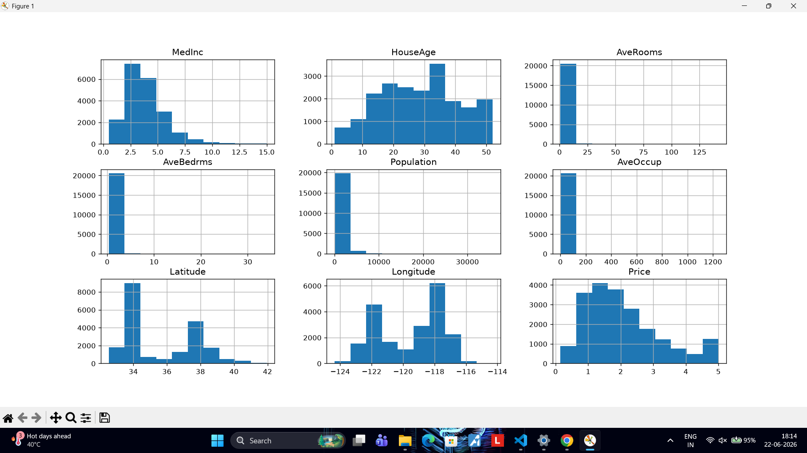
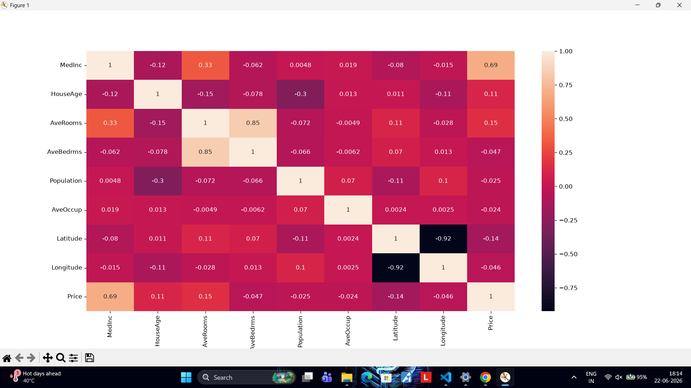

# 🏡 House Price Prediction using Linear Regression

A Machine Learning project that predicts California house prices using the Linear Regression algorithm from Scikit-learn. This project demonstrates the complete machine learning workflow, including data loading, exploratory data analysis (EDA), model training, evaluation, visualization, and model saving.

---

## 📌 Project Objective

The objective of this project is to build and evaluate a Linear Regression model capable of predicting house prices using the California Housing Dataset. It introduces the end-to-end machine learning pipeline and provides hands-on experience with regression modeling.

---

## 📂 Dataset

- **Dataset:** California Housing Dataset
- **Source:** Scikit-learn
- **Number of Samples:** 20,640
- **Number of Features:** 8

### Features

- MedInc – Median Income
- HouseAge – Median House Age
- AveRooms – Average Rooms
- AveBedrms – Average Bedrooms
- Population – Population
- AveOccup – Average Occupancy
- Latitude – Latitude
- Longitude – Longitude

**Target Variable:**
- Price (Median House Value)

---

## 🛠️ Technologies Used

- Python
- Pandas
- NumPy
- Matplotlib
- Seaborn
- Scikit-learn
- Jupyter Notebook

---

## 📊 Exploratory Data Analysis (EDA)

The dataset was analyzed before training the model using:

- Dataset information
- Statistical summary
- Missing value check
- Feature distribution plots
- Correlation heatmap

---

## 🤖 Machine Learning Model

**Algorithm Used**

- Linear Regression

### Workflow

1. Load Dataset
2. Perform Data Analysis
3. Visualize Data
4. Split Dataset into Training and Testing Sets
5. Train Linear Regression Model
6. Predict House Prices
7. Evaluate Performance
8. Save the Trained Model

---

## 📈 Model Evaluation

The model performance was evaluated using:

- Mean Absolute Error (MAE)
- Root Mean Squared Error (RMSE)
- R² Score

These metrics help determine how accurately the model predicts house prices.

---

## 📷 Project Screenshots

### Dataset Feature Distribution



---

### Correlation Heatmap



---

### Actual vs Predicted House Prices


---

## 📁 Project Structure

```
Task1/
│
├── task1_ml_linear_regression.ipynb
├── README.md
│
└── screenshots/
    ├── dataset.png
    ├── heatmap.png
    └── prediction.png
```

---

## 🚀 How to Run the Project

### 1. Clone the Repository

```bash
git clone https://github.com/mahakdhuriya/Task1_Linear_Regression.git
```

### 2. Install Required Libraries

```bash
pip install pandas numpy matplotlib seaborn scikit-learn jupyter
```

### 3. Launch Jupyter Notebook

```bash
jupyter notebook
```

### 4. Open

```
task1_ml_linear_regression.ipynb
```

### 5. Run all cells.

---

## 💡 Future Improvements

- Apply Feature Engineering
- Remove Outliers
- Perform Hyperparameter Tuning
- Compare with Decision Tree Regressor
- Compare with Random Forest Regressor
- Compare with XGBoost Regressor

---

## 🎯 Learning Outcomes

Through this project, I learned:

- Data preprocessing using Pandas
- Exploratory Data Analysis (EDA)
- Data visualization using Matplotlib and Seaborn
- Building a Linear Regression model
- Model evaluation using MAE, RMSE, and R² Score
- Saving trained models using Pickle
- Organizing an end-to-end Machine Learning project

---

## 👨‍💻 Author

**Mahak Dhuriya**

GitHub: https://github.com/mahakdhuriya

LinkedIn: https://linkedin.com/in/mahakdhuriya110903

---

⭐ If you found this project useful, consider giving it a star!
